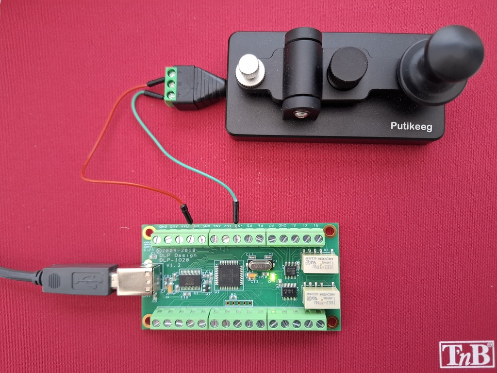

# dlp-io20

The DLP-IO20 is a simple USB data acquisition module which permits to receive or send 0-5V TTL signals. From a software point of view, it is controlled by writing and reading on a virtual serial device.

A full description of the DLP-IO20 is available at <https://www.dlpdesign.com/usb/dlp-io20-ds-v11.pdf>

It is sold by, e.g.,[rs-online](https://co-en.rs-online.com/product/dlp-design/dlp-io20/70372088/)


## Installation

### Linux 


* To use it under Python, you need to install `pyserial`:

       pip install pyserial

* Add yourself to the `tty` and `dialup` groups:

       sudo usermod -a -G tty $USER
       sudo usermod -a -G dialout $USER 

* Load the following drivers:

       sudo modprobe ftdi_sio
       sudo modprobe usebserial

* run `sudo dmesg -w` and plug the DLP into a usb port of your computer. You should see a message such as:


      FTDI USB Serial Device converter now attached to ttyUSB0


This means that the DLP is accessible on `/dev/ttyUSB0` 

### Montage

Here is a simple montage with a morse key connecting AN4 to +5V when pressed.




## Usage 

### Example 1


```python
    from serial import Serial
    from time import sleep
    
    dlp = Serial(port='/dev/ttyUSB0', baudrate=115200)  # open serial port

    # Check that the board is alive
    PING = 0x27
    dlp.write(bytearray([2, PING]))
    response = dlp.read(1).decode('utf-8')
    if response == 'Y':
        print('DLP-IO20 detected')
    else:
        print('DLP-IO20 not responding')

    print('Flashing LED')
    FLASH_LED = 0x28
    dlp.write(bytearray([2,FLASH_LED]))  # blink LED D1

    DIGITAL_IO = 0x35
    DIR_OUTPUT = 0
    DIR_INPUT = 1
    SET_LOW = 0
    SET_HIGH = 1

    # Program Channel AN2 as digital output
    dlp.write(bytearray([5, DIGITAL_IO, 2, DIR_OUTPUT, SET_HIGH]))
    sleep(0.5)
    dlp.write(bytearray([5, DIGITAL_IO, 2, DIR_OUTPUT, SET_LOW]))
    sleep(0.5)

    # Read Channel AN0 state
    for _ in range(10):
        dlp.write(bytearray([5, DIGITAL_IO, 0, DIR_INPUT, 0]))
        print(ord(dlp.read().decode('utf-8')))
        sleep(1)

```    


